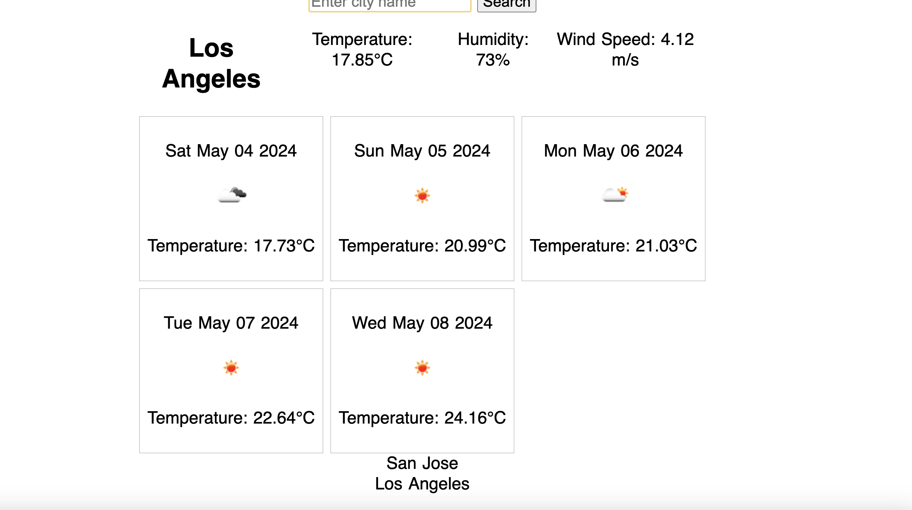

# Weather API

## Description

My motivation to create this project was to make a to create a website to provide users a way to search the current weather and the five day forecast in a user friendly format. I built this project to create a place to access weather. This site solves the problem of not having a place to know where to look for current weather and the five day forecast. I learned how to use server-side APIs.

## Deployed Site

The deployed website can be reached at the following link.

https://stefanfilm.github.io/weatherapi/

## Installation

To install the project, pull the code from https://github.com/stefanfilm/weatherapi and open it in a code editor. Open the script.js in the code editor and view the JavaScript. You could open the index.html file in a browser to see the code function.

## Usage

To use the website, enter a city name in the text input area and click search. Information will appear with data about the temperature, humidity, and wind speed. You will also see the five day weather forecast for the city. If you enter another city, you will see that info. The recently searched cities will be accessible at the bottom of the page.

    ```md
    
    ```

## Credits

I worked on this project under the instruction of Mark Carlson in the UC Berkeley Software Developer Bootcamp.

## License

The license is an MIT license. Please refer to the GitHub Repository for details on the license. 

## Badges


